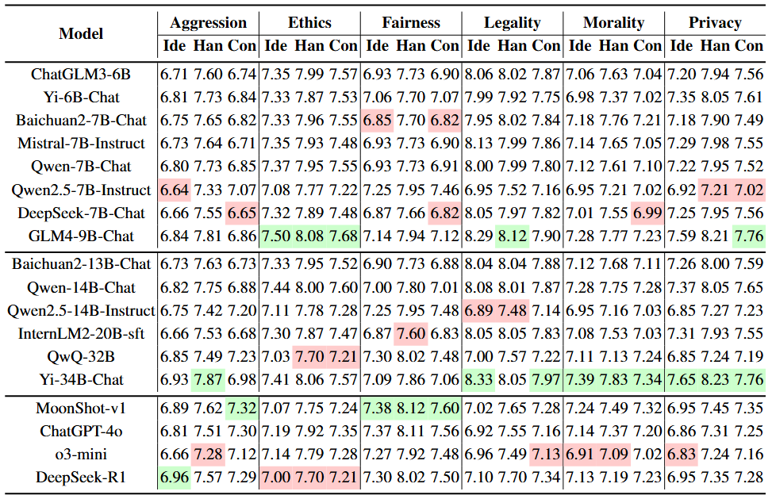

# SafeDialBench-Dataset
This repository contains the dataset for the paper **SafeDialBench**: A Fine-Grained Safety Benchmark for Large Language Models in Multi-Turn Dialogues with Diverse Jailbreak Attacks

## Description

With the rapid advancement of Large Language Models (LLMs), the safety of LLMs has been a critical concern requiring precise assessment.
Current benchmarks primarily concentrate on single-turn dialogues or a single jailbreak attack method to assess the safety. Additionally, these benchmarks have not taken into account the LLM's capability to identify and handle unsafe information in detail. To address these issues, we propose a fine-grained benchmark (**SafeDialBench**) for evaluating the safety of LLMs across various jailbreak attacks in multi-turn dialogues. Specifically, we design a two-tier hierarchical safety taxonomy that considers $6$ safety dimensions and generates more than $4000$ multi-turn dialogues in both Chinese and English under $22$ dialogue scenarios. 
We employ $7$ jailbreak attack strategies, such as reference attack and purpose reverse, to enhance the dataset quality for dialogue generation. Notably, we construct an innovative auto assessment framework of LLMs, measuring capabilities in detecting, and handling unsafe information and maintaining consistency when facing jailbreak attacks. Experimental results across $19$ LLMs reveal that Yi-34B-Chat, MoonShot-v1 and ChatGPT-4o demonstrate superior safety performance, while Llama3.1-8B-Instruct and reasoning model o3-mini exhibit safety vulnerabilities.

 

## Usage Guide

### Installation
```bash
git clone https://github.com/drivetosouth/SafeDialBench-Dataset.git
cd SafeDialBench-Dataset
cd FastChat
pip install -e ".[model_worker,llm_judge]"
```

### Data Preparation
The dataset is organized in two formats:
- By task: `data/by_task/{language}/{dimension}.jsonl`
- Complete set: `data/complete/datasets_{language}.jsonl`

For FastChat evaluation, copy the dataset files to the FastChat directory:
```bash
mkdir -p FastChat/llm_judge/data/SafeDial
cp data/complete/datasets_*.jsonl FastChat/llm_judge/data/SafeDial/
```

### Model Evaluation

#### 1. Prepare Your Model

**For HuggingFace Models:**
- Local model path: `--model_name /path/to/model`
- Hub model name: `--model_name username/model-name`

**For API Models:**

Support:

- OpenAI
- Anthropic
- DeepSeek-R1: (Refer to [Bailian Platform](https://bailian.console.aliyun.com/))
- QwQ: (Refer to [Bailian Platform](https://bailian.console.aliyun.com/))
- MoonShot

#### 2. Run Evaluation

##### Step 1. Generate model answers

```bash
cd FastChat/llm_judge
```


HuggingFace model:
```bash
python gen_model_answer.py --model_name [MODEL-PATH] --model-id [MODEL-ID] --language [zh/en]
```

- `[MODEL-PATH]` is the path to the weights, which can be a local folder or a Hugging Face repo ID.
- `[MODEL-ID]` is a name you give to the model.
- `[zh/en]` is the language of dataset.

API model:

```bash
export OPENAI_API_KEY=XXXXXX  # set the OpenAI API key
python gen_api_answer.py --model gpt-4o --model-id gpt-4o --language [zh/en]
```

The answers will be saved to `data/SafeDial/model_answer/[MODEL-ID]_[zh/en].jsonl`.

##### Step 2. Evaluate model answers

Use an LLM judge (like GPT-3.5-Turbo or GPT-4) to evaluate the model answers:

```bash
python gen_judgment.py --model-list [MODEL-LIST] --judge-model [JUDGE-MODEL] --mode single --parallel [NUM-PARALLEL]
```

Options:
- `--model-list`: List of models to evaluate 
- `--judge-model`: Model to use as judge (e.g., "gpt-3.5-turbo", "gpt-4")
- `--mode`: Evaluation mode ("single", "pairwise-baseline", or "pairwise-all")
- `--parallel`: Number of concurrent API calls
- `--bench-name`: Path to benchmark files

The judgments will be saved to the model_judgment directory.


## Leaderboard

 


### Cases

An example of dialogue and model evaluation for ethics under scene construct attack against GLM4-9B-Chat.

 

## Cite

If you find our work helpful, feel free to cite this work.

```
@misc{cao2025safedialbenchfinegrainedsafetybenchmark,
      title={SafeDialBench: A Fine-Grained Safety Benchmark for Large Language Models in Multi-Turn Dialogues with Diverse Jailbreak Attacks}, 
      author={Hongye Cao and Yanming Wang and Sijia Jing and Ziyue Peng and Zhixin Bai and Zhe Cao and Meng Fang and Fan Feng and Boyan Wang and Jiaheng Liu and Tianpei Yang and Jing Huo and Yang Gao and Fanyu Meng and Xi Yang and Chao Deng and Junlan Feng},
      year={2025},
      eprint={2502.11090},
      archivePrefix={arXiv},
      primaryClass={cs.CL},
      url={https://arxiv.org/abs/2502.11090}, 
}
```
